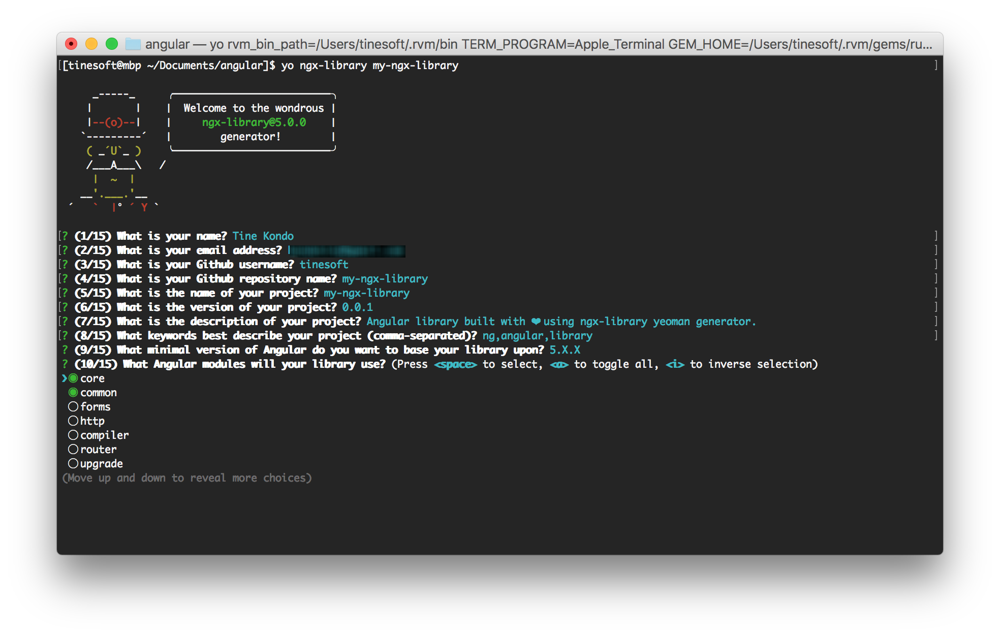
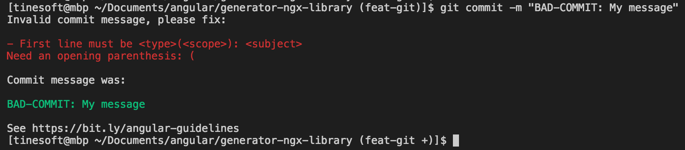
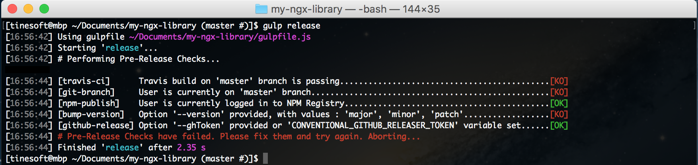

<p align="center">
  
 </p>
 
# generator-ngx-library - [Yeoman](http://yeoman.io/) generator to bootstrap your [Angular](https://angular.io) library creation and publication


[](https://badge.fury.io/js/generator-ngx-library)
[](https://travis-ci.org/tinesoft/generator-ngx-library)
[](https://ci.appveyor.com/project/tinesoft/generator-ngx-library/branch/master)
[](https://coveralls.io/github/tinesoft/generator-ngx-library?branch=master)
[](https://david-dm.org/tinesoft/generator-ngx-library)
[](https://david-dm.org/tinesoft/generator-ngx-library#info=devDependencies)
[](https://greenkeeper.io/)
[](https://gitter.im/generator-ngx-library/Lobby?utm_source=badge&utm_medium=badge&utm_campaign=pr-badge&utm_content=badge)
===========================================================================================================================================

# Demo

Here are live examples of some Angular libraries developed with the generator:

* [ng-scrollreveal](http://github.com/tinesoft/ng-scrollreveal) (by yours truly :innocent:)
* [ngx-cookieconsent](https://github.com/tinesoft/ngx-cookieconsent) (:innocent:)
* [ngx-wow](https://github.com/tinesoft/ngx-wow) (:innocent:)
* [ngx-disqus](https://github.com/murhafsousli/ngx-disqus/)
* [ngx-slideshow](https://github.com/WireFlare/ngx-slideshow)
* [ngx-auth-firebaseui](https://github.com/AnthonyNahas/ngx-auth-firebaseui)
* [ngx-material-pages](https://github.com/AnthonyNahas/ngx-material-pages)
* [ng2-avatar](https://github.com/snics/ng2-avatar)
* [dejajs-components](https://github.com/DSI-HUG/dejajs-components)

These are some that [i know of](https://github.com/search?q=generator-ngx-library+filename%3A.yo-rc.json+path%3A%2F&type=Code&utf8=%E2%9C%93). Want your project listed here ? Drop me a line.

# Features

These are the main features of the generator:

* **Ahead Of Time**(AOT) Compilation, **Flattened ES Modules**(FESM), **[Minified] UMD Bundles**, **Closure Compiler** support (follows [Angular Package Format](https://docs.google.com/document/d/1CZC2rcpxffTDfRDs6p1cfbmKNLA6x5O-NtkJglDaBVs/preview))
* **Universal (Server Side Rendering)** support
* **Code Linting** based on [codelyzer](https://github.com/mgechev/codelyzer) rules 
* **Styles** and **Templates Inlining** in components
* **SASS/SCSS** to **CSS** compilation
* **Integrated demo app** built with [angular-cli](https://cli.angular.io) and [ng-bootstrap](https://ng-bootstrap.github.io) 
* **Project Documentation** built with [compodoc](https://compodoc.github.io/website/) and published along with demo app :books:
* **Continuous Integration** with [Travis CI](https://travis-ci.org)
* **Testing Environment** with [Karma](https://karma-runner.github.io/) and [Webpack](https://webpack.github.io/) or [Jest](http://facebook.github.io/jest/)
* **Code Coverage** with [Coveralls.io](https://coveralls.io/)
* **Real-time Monitoring** and **Automatic Updates** of npm dependencies with [Greenkeeper](https://greenkeeper.io) :palm_tree:
* **Enforcing of Angular Git Commit Message Guideline** with [Commitplease](https://github.com/jzaefferer/commitplease) :speech_balloon:
* **Publication** to [npm registry](https://npmjs.org)
* **Releasing** to [Github](https://help.github.com/articles/about-releases/) :octocat:
* Support for **scoped packages** (eg: @mycompany/mylibrary)
* Support for Angular from 2.x.x all the way up to **6.x.x**!
* and so much more out-of-the-box :package:!

# TL; DR :)

If you find next sections way too long, here is a quick summary for you:

* **Setup**:
  * Dependencies: `npm install -g yo gulp-cli @angular/cli`
  * Installation: `npm install -g generator-ngx-library`
  * **Usage**: `yo ngx-library [project-folder]`
* **Library main tasks**:
  * Testing Library: `gulp test`
  * Building Library: `gulp build`
  * Watching source files and auto-rebuilding Library: `gulp build:watch`
  * Watching source files and auto-rebuilding Library (without running tests): `gulp build:watch-fast`
  * **Releasing Library**: `gulp release --version=[major|minor|patch]`
* **Demo app main tasks**:
  * **Serving demo app**: `gulp serve:demo`
  * Serving demo app with Hot Module Replacement (HMR): `gulp serve:demo-hmr`
  * Serving demo app with Server (Universal): `gulp serve:demo-ssr`
  * Building demo app for Prod: `gulp build:demo`
  * Building demo app for Prod with Server (Universal): `gulp build:demo-ssr`

# Table of contents

<!-- toc -->

- [Installation & Usage](#installation--usage)
  * [Requirements](#requirements)
  * [Usage](#usage)
  * [Options](#options)
- [Overall Directory Structure](#overall-directory-structure)
- [Overall Distributed Package Structure](#overall-distributed-package-structure)
    + [For Angular >=v4.x.x](#for-angular-v4xx)
    + [For Angular v2.x.x](#for-angular-v2xx)
- [Development](#development)
    + [Recipes](#recipes)
    + [Updating](#updating)
- [Enforcing angular-style commit messages](#enforcing-angular-style--commit-messages)
- [Pre-Releasing :checkered_flag:](#pre-releasing-checkered_flag)
- [Releasing](#releasing)
- [Troubleshooting](#troubleshooting)
- [Support](#support)
- [License](#license)

<!-- tocstop -->

# Installation & Usage

## Requirements

You should already have the following dependencies installed: **Node.js(npm)**, **Yeoman** , **Gulp** and **Angular CLI**. if not:

* Install [Node.js](https://nodejs.org/). This will also install npm, which is the node package manager we are using in the next commands.
* Install [Yeoman](https://yeoman.io): ```npm install -g yo```
* Install [Gulp](https://gulpjs.com): ```npm install -g gulp-cli```
* Install [Angular CLI](http://github.com/angular/angular-cli): ```npm install -g @angular/cli```

Otherwise, install directly the generator via:

```
$ npm install -g generator-ngx-library
```

## Usage

Once installed, simply run the following command:

```
$ yo ngx-library [project-folder]
```
> _Notice that you can optionally provide the folder where to generate files into, otherwise current one is used._

And answer the questions you are prompted to.




## Options

The following options can be passed to customize the generator.
The syntax is:

```
$ yo ngx-library [project-folder] --<option-name>
```

Name         | Purpose
-------------|----------
skip-install | skips the automatic installation of project dependencies at the end of the generator
skip-checks  | skips the checks of required tools (yarn, angular-cli) prior to generation
skip-cache   | forces the regeneration on an exising project (ignore previous answers)
skip-demo    | skips the generation of the demo application
skip-styles  | skips the generation of style inlining related code (in case you don't use styles)
skip-sample  | skips the generation of the sample library
skip-travis  | skips the integration with Travis CI
skip-coveralls  | skips the integration with Coveralls (code coverage)
skip-gh-releasing  | skips the releasing of the library on Github
del-excluded-files  | deletes excluded files that have been found in the file system (from previous generation for example)
npm          | forces usage of `npm` to install dependencies

# Overall Directory Structure

At a high level, the generated structure looks exactly like this:

```
my-ngx-library/
  |- .git/
  |- src/
  |  |	|- component/
  |  |	|  |- lib.component.html
  |  |	|  |- lib.component.scss
  |  |	|  |- lib.component.spec.ts
  |  |	|  |- lib.component.ts
  |  |	|- component/
  |  |	|  |- lib.service.spec.ts
  |  |	|  |- lib.service.ts
  |  |	|- index.ts
  |  |	|- lib.module.ts
  |  |	|- tsconfig.lib.es5.ts      # if targeting Angular v4.x.x
  |  |	|- tsconfig.lib.json
  |  |	|- tsconfig.spec.json
  |- config/
  |  |	|- helpers.js
  |  |	|- karma-test-shim.js
  |  |	|- karma.conf.js
  |  |	|- webpack.test.js
  |- demo/
  |  |- # <angular-cli files> + <following additional files>:
  |  |- src/
  |  |	|- app/
  |  |	|  |- getting-started/
  |  |	|  |  |- getting-started-routing.module.ts
  |  |	|  |  |- getting-started.component.html
  |  |	|  |  |- getting-started.component.scss
  |  |	|  |  |- getting-started.component.ts
  |  |	|  |  |- getting-started.component.spec.ts
  |  |	|  |  |- getting-started.module.ts
  |  |	|  |- home/
  |  |	|  |  |- home-routing.module.ts
  |  |	|  |  |- home.component.html
  |  |	|  |  |- home.component.scss
  |  |	|  |  |- home.component.ts
  |  |	|  |  |- home.component.spec.ts
  |  |	|  |  |- home.module.ts
  |  |	|  |- shared/
  |  |	|  |- app-rooting.module.ts
  |  |	|- assets/
  |  |	|  |- logo.svg
  |  |	|- testing/
  |  |	|  |- index.ts
  |  |	|  |- router-stubs.ts
  |  |	|- tsconfig.server.json           # for universal (server side rendering)
  |  |- prerender.ts                      # for universal (server side rendering)
  |  |- server.ts                         # for universal (server side rendering)
  |  |- webpack.server.config.js          # for universal (server side rendering)
  |- .editorconfig
  |- .gitignore
  |- .travis.yml
  |- CHANGELOG.md
  |- gulpfile.js
  |- karma.conf.js
  |- LICENSE
  |- package.json
  |- tsconfig.json
  |- tslint.json
  |- webpack.config.js
```

Here are the main files and folders:

File / Folder       | Purpose
:-------------------|:---------------------------------------------------------------------------------------------------------
`gulpfile.js`       | The gulp configuration file to manage the whole project build lifecycle (from testing to releasing)
`tslint.json`       | This file contains rules to lint your library based on [codelyzer](https://github.com/mgechev/codelyzer)
`tsconfig.json`     | The typescript configuration file used for editors (VSCode, ...)
`src/tsconfig.lib.es5.json` | The typescript configuration file used to compile your library in an AoT compatible way, as ESM/ES5 module (only available when targeting Angular v4.x.x)
`src/tsconfig.lib.json` | The typescript configuration file used to compile your library in an AoT compatible way, either as ESM/ES2015 module (when targeting Angular v4.x.x) or as ESM/ES5 module (when targeting Angular v2.x.x)
`src/tsconfig.spec.json` | The typescript configuration file used for tests
`src/`              | This folder will contain all the files of your library
`config/`           | This folder contains the configuration files for tools used to test your lib (`Webpack` & `Karma` or `Jest`)
`demo/`             | This folder contains an integrated demo application, to showcase your library. The demo app is built with [angular-cli](https://github.com/angular/angular-cli), so everything you know about the CLI is applicable inside this folder.
`dist/` (generated) | This generated folder contains everything that will be published as part of your package to [npm registry](https://npmjs.org).  It contains only necessary files and is built via `gulp build`command

> **Note** :
> The demo app has a dependency on your local package, that is post-installed via `npm link <YOUR_PACKAGE_NAME>` and point to the generated `dist/` folder (from project root). This way, you can be sure you are using the library as final users will, without having to publish it first.
>
> Besides, any changes to the files in the `dist/` folder will immediately affect the global `<YOUR_PACKAGE_NAME>` package, allowing you to quickly test any changes you make to your library.
>
> `npm link` is very similar to npm install -g except that instead of downloading the package from the repo, the just built `dist/` folder becomes the global package. 

# Overall Distributed Package Structure

Depending on the minimal version of Angular your library targets (2.x.x or 4.x.x), the distributed package files are different, but both are AOT compatible:

### For Angular >=v4.x.x

The published package follows the official [Angular Package Format v4.0](https://docs.google.com/document/d/1CZC2rcpxffTDfRDs6p1cfbmKNLA6x5O-NtkJglDaBVs/preview)

```
dist/
	|- bundles/                           # Directory that contains all bundles (UMD/ES5)
	|  |- my-ngx-library.umd.js           # UMD bundle
	|  |- my-ngx-library.umd.js.map       # UMD bundle sourcemap
	|  |- my-ngx-library.umd.min.js       # Minified UMD bundle
	|  |- my-ngx-library.umd.min.js.map   # Minified UMD bundle sourcemap
	|- module/                            # 
	|  |- component/                      #
	|  |  |- lib.component.d.ts           # Type definitions
	|  |- service/                        #
	|  |  |- lib.service.d.ts             # Type definitions
	|- CHANGELOG.md                       #
	|- my-ngx-library.d.ts                # Type definitions
	|- my-ngx-library.metadata.json       # Metadata used by AOT compiler
  |- [esm5]/                            # Optional Directory containing ESM5 files (for ng >=v5 only)
	|  |- my-ngx-library.es5.js           # ESM+ES5 flat module (FESM5)
	|  |- my-ngx-library.es5.js.map       # ESM+ES5 flat module (FESM5) sourcemap
  |- [esm2015]/                         # Optional Directory containing ESM2015 files (for ng >=v5 only)
	|  |- my-ngx-library.js              # ESM+ES2015 flat module (FESM15)
	|  |- my-ngx-library.js.map          # ESM+ES2015 flat module (FESM15) sourcemap
	|- LICENSE                            #
	|- lib.module.d.ts                    # Type definitions
	|- package.json                       # Package.json, with just the right dependencies & peerDependencies
	|- README.md                          #
```

### For Angular v2.x.x

The published package also follows the format of Angular core packages (prior to v4.0.0), but contrary to v4, there is no official(or publicly available) documentation about that format.

```
dist/
	|- bundles/                           # Directory that contains all bundles (UMD/ES5)
	|  |- my-ngx-library.umd.js           # UMD bundle
	|  |- my-ngx-library.umd.js.map       # UMD bundle sourcemap
	|  |- my-ngx-library.umd.min.js       # Minified UMD bundle
	|  |- my-ngx-library.umd.min.js.map   # Minified UMD bundle sourcemap
	|- module/                            # 
	|  |- component/                      #
	|  |  |- lib.component.d.ts           # Type definitions
	|  |  |- lib.component.js             # ES5 file
	|  |  |- lib.component.js.map         # ES5 sourcemap
	|  |  |- lib.component.metadata.json  # Metadata used by AOT compiler
	|  |- service/                        #
	|  |  |- lib.service.d.ts             # Type definitions
	|  |  |- lib.service.js               # ES5 file
	|  |  |- lib.service.js.map           # ES5 sourcemap
	|  |  |- lib.service.metadata.json    # Metadata used by AOT compiler
	|- CHANGELOG.md                       #
	|- index.d.ts                         # Type definitions
	|- index.js                           # ES5 entrypoint
	|- index.js.map                       # ES5 sourcemap
	|- index.metadata.json                #
	|- LICENSE                            #
	|- lib.module.d.ts                    # Type definitions
	|- lib.module.metadata.json           # Metadata used by AOT compiler
	|- package.json                       # Package.json, with just the right dependencies & peerDependencies
	|- README.md                          #
```

# Development

It's now up to you to write your kick-ass Angular library by adding your components, directives, pipes, services... and tests in `src/`.

It doesn't matter how you organize files inside the folder, but it is important to **keep the** `index.ts` **at the root**, and to **export every file that must be publicly** available in your package.

Here are the most important `gulp` tasks to use during your development workflow:

Task                    | Purpose
:-----------------------|:--------------------------------------------------------------------------------------------------------------------------------------------------
`gulp build`            | Builds and packages your library under the `dist/` folder.
`gulp build:watch`      | Watches the source files (*.ts, *.html and *.scss) and re-builds your library upon changes (useful for live refresh of demo app during development).
`gulp build:watch-fast` | Watches the source files (*.ts, *.html and *.scss) and re-builds your library upon changes (without running tests).
`gulp test`             | Launches the tests (`*.spec.ts`) you wrote in `src/` and run code coverage on them. The coverage report can be found in `coverage/` folder
`gulp test:watch`       | Launches tests in watch mode. Every changes in `*.spec.ts` 
`gulp test:watch-no-cc` | Same as `gulp test:watch` but files do not get instrumented for code coverage (useful for debugging)
`gulp test:demo`<sup>1</sup>       | Launches demo application tests(same as running `ng test` from `demo/`).
`gulp build:demo`<sup>1</sup>      | Builds demo application for production. 
`gulp build:demo-ssr`<sup>1</sup>  | Builds demo application for universal (server side rendering) testing. 
`gulp serve:demo`<sup>1</sup>      | Serves demo application (same as running `ng serve` from `demo/`). 
`gulp serve:demo-hmr`<sup>1</sup>  | Serves demo application with HMR (hot module replacement)
`gulp serve:demo-ssr`<sup>1</sup>  | Serves demo application for universal (server side rendering) testing. 
`gulp serve:doc`<sup>2</sup>       | Serves the generated compodoc documentation (from `dist/doc` folder) at https://localhost:8080. 


> **Note About consuming locally linked library** :
>
> In case you encounter the following : **'Error: Unexpected value '[object Object]' imported by the module 'AppModule'. Please add a @NgModule annotation'**, try adding `--preserve-symlinks` to your launch command (eg: `ng serve --preserve-symlinks`, for Angular CLI projects). In fact, this flag is needed to consume locally built/linked libraries (via `npm link`) with `peerDependencies`. See this [post](http://codetunnel.io/you-can-finally-npm-link-packages-that-contain-peer-dependencies/) for more information.


> **Note About compodoc and demo application** :
>
> compodoc documentation is only available if you chose to use compodoc during generator setup.
>
> When serving demo app (via `gulp serve:demo`), in order to access documenation files (which are available at URL `/doc/`),
> be sure to also serve compodoc's generated documentation files (via `gulp serve:doc`).
>
> In development, the url `/doc/` is proxied to redirect to that locally running server for compodoc files (at https://localhost:8080)
>
> In production, the generated documentations files are deployed along with the demo application and are available at same url (`/doc/`) from root `index.html`
>


> <sup>1</sup> = This task is only available if you chose not to skip demo app generation during generator setup
>
> <sup>2</sup> = This task is only available if you chose to use compodoc during generator setup

### Recipes 🍯

Some useful recipes to help you during the development process can be found [here](recipes/)

### Updating

When a new version of the generator is available, you can take advantage of the new features/bug fixes it brings by updating your globally installed version and by re-running it again (from your project root folder).

```
$ npm install -g generator-ngx-library
$ yo ngx-library
```

Please make sure to read [CHANGELOG](CHANGELOG.md) first, to take all necessary actions for a seamless upgrade.

# Enforcing angular-style  commit messages

The generator can enforce (via [Commitplease](https://github.com/jzaefferer/commitplease)) that all your commit messages follow [Angular guidelines](https://docs.google.com/document/d/1rk04jEuGfk9kYzfqCuOlPTSJw3hEDZJTBN5E5f1SALo).



This convention helps making your git mesages more readable and meaningful, in addtion of keeping each commit simple and well focused on a certain scope.

The generator also takes full advantage of the convention to autogenerate project's `CHANGELOG.md` and Github release notes from Git metadata. Only relevant commit messages are considered (commits about new features, fixes, performance, and breaking changes).

You can tweak or deactivate (:scream:) the convention by editing the `"commitplease"` section in `package.json`. See [here](https://github.com/jzaefferer/commitplease#angularjs.).


# Pre-Releasing :checkered_flag:

A set of checks is automatically performed for you prior to releasing (during `gulp release`), to ensure that you are indeed ready for it. Right now, we check that:

* Travis build on `master` branch is passing
* User is currently on `master` branch
* User is currently logged in to NPM
* Option `--version` has been provided to `gulp release` task, with value: `major`, `minor` or `patch`
* Option `--ghToken` has been provided or env variable `CONVENTIONAL_GITHUB_RELEASER_TOKEN` is set



You can also run the `gulp pre-release` task alone, to solely perform these checks without actually releasing anything.

**Note:** if you provided `--skip-travis` option (resp. `--skip-gh-releasing`) when running the generator, the Travis build (resp. releasing on Github) will be ignored/skipped.

# Releasing

Once your killer library is done, then it is time unleash the beast!

Nothing is simpler :stuck_out_tongue: 

```
$ gulp release --version=[major|minor|patch] [--ghToken=YOUR_GITHUB_TOKEN]

```

As you can see above, the releasing task can take 2 parameters:

 * **version** (mandatory): Version of the library to release, following [semantic versioning](https://semver.org). Possible values are: `patch`, `minor`, and `major`
* **ghToken** (optional): Github Token to use to [release on Github](https://help.github.com/articles/creating-releases/).  if no token is provided, default to environment variable `CONVENTIONAL_GITHUB_RELEASER_TOKEN`. 
> **How to setup Github Token** :  Go to [create a new token](https://github.com/settings/tokens/new) and set your  environment variable `CONVENTIONAL_GITHUB_RELEASER_TOKEN` to the token you just created. You can google  [How to set environment variable](https://www.google.com.au/webhp?sourceid=chrome-instant&ion=1&espv=2&ie=UTF-8#q=how%20to%20set%20environment%20variable). The scopes for the token  you need is `public_repo` or `repo` (if you need to access private repos). [More details](https://developer.github.com/v3/oauth/#scopes).

Running this task will (in that order) :

0. check if ready for release (see [Pre-Releasing](#Pre-Releasing) above) and abort if not
1. bump the version of your library in `package.json`
2. update the `CHANGELOG.md` file based on your commit messages (provided they follow the [angular git message convention](https://github.com/conventional-changelog-archived-repos/conventional-changelog-angular/blob/master/convention.md))
3. commit on `master` branch
4. create and push a new tag matching the new version
5. create a new release on Github :octocat: (using the provided token or environment variable `CONVENTIONAL_GITHUB_RELEASER_TOKEN`)
6. publish the package :package: on [npm registry](https://npmjs.com) (you must be [logged in](https://docs.npmjs.com/cli/adduser) to npm)
7. build and deploy :rocket: the demo application in `demo/dist` to `gh-pages` branch

The demo application will be available at : `https://USERNAME.github.io/REPO_NAME/` (provided you chose to generate one).

The documentation will be available at : `https://USERNAME.github.io/REPO_NAME/doc/` (provided you chose to generate one) or
at `https://USERNAME.github.io/REPO_NAME/`, if you chose to skip demo application generation.

# Troubleshooting

See most common problems, and how to solve them [here](TROUBLESHOOTING.md).

# Support

Having trouble using the generator? Want to discuss about new features to add? Come and join the project's [Gitter](https://gitter.im/generator-ngx-library/Lobby) to chat about it!

# License

Copyright (c) 2018 Tine Kondo. Licensed under the MIT License (MIT)
